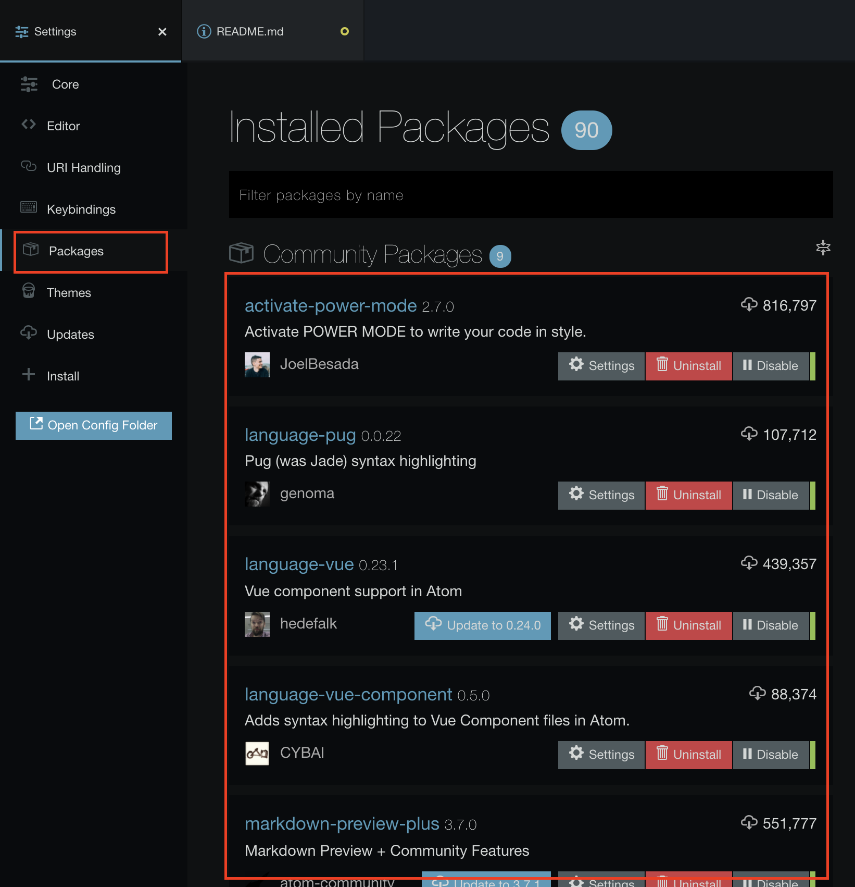

# Computer Environment Setting

## Category
* [Windows](#windows)
* [Ubuntu](#ubuntu)
* [MacOS](#macos)
* Editor:
  * [Atom](#atom)
  * [Visual Studio Code](#visual-studio-code)

## Windows
For windows OS, we'll use "Windows Subsystem for Linux" to use unix-command terminal.

Therefore, you have to install "Ubuntu on windows", and complete [Ubuntu OS environment setting](#ubuntu).

### 1. Open "Developer mode"

Steps: 設定(Setting) -> 更新與安全性(Update & Security) -> 開發人員專用(For developers) -> Select "開發人員模式"(Developer mode)


### 2. Enable "Windows Subsystem for Linux"

Steps:
  1. 左下角搜尋並開啟"開啟或關閉 Windows 功能"(Search & open "Turn Windows features on or off")
  
  2. 勾選"Windows 子系統 Linux 版"(Select "Windows Subsystem for Linux")
  

  3. Install Ubuntu in Microsoft Store.
  

  4. Open cmd and execute following command
      ```
      $ bash
      ```
      

  5. Follow the [Ubuntu OS environment setting](#ubuntu).

## Ubuntu
Execute the following command to install google test library:
```shell
$ sudo apt-get update
$ sudo apt-get install g++
$ sudo apt-get install make
$ sudo apt-get install libgtest-dev
$ sudo apt-get install cmake
$ cd /usr/src/gtest
$ sudo cmake CMakeLists.txt
$ sudo make
$ cd lib
$ sudo cp *.a /usr/lib
```

## MacOS
1. Execute following command in terminal to install [Homebrew](https://brew.sh/index_zh-tw).
    ```shell
    $ /bin/bash -c "$(curl -fsSL https://raw.githubusercontent.com/Homebrew/install/HEAD/install.sh)"
    ```

2. Download [google test source](https://github.com/google/googletest/archive/release-1.8.0.zip)

3. Execute the following command to install google test library:
    ```shell
    $ brew install cmake
    $ cd ~/Downloads/googletest-release-1.8.0/googletest
    $ mkdir build
    $ cd build
    $ cmake -Dgtest_build_samples=ON -Dgtest_build_tests=ON ~/Downloads/googletest-release-1.8.0/googletest
    $ make
    // If there is no `Celler` folder in `/usr/local`, please execute the following command
    // $ sudo mkdir /usr/local/Cellar
    $ sudo mkdir /usr/local/Cellar/gtest
    $ sudo cp ~/Downloads/googletest-release-1.8.0/googletest/build/libgtest.a /usr/local/Cellar/gtest/
    $ sudo ln -snf /usr/local/Cellar/gtest/libgtest.a /usr/local/lib/libgtest.a
    $ sudo cp -r ~/Downloads/googletest-release-1.8.0/googletest/include /usr/local/Cellar/gtest/
    $ ln -snf ../Cellar/gtest/include/gtest /usr/local/include/gtest
    ```

## Atom
**[Download link](https://atom.io)**

### Install packages
1. Open setting page
- Windows: File -> Settings
- MacOS: Atom -> Preference

2. Install packages:
  * Install -> search package with name, for example, `platformio-ide-terminal`
  * Select project you want, and Install
  

3. Package management
  * Overview, disable or uninstall installed packages.
  

## Visual Studio Code
**[Download link](https://code.visualstudio.com/download)**

### Install packages
1. Open Extensions:
  * Search package with name, for example, `C/C++`
  * Select project you want, and Install
  

2. Package management
  * Overview, disable or uninstall installed packages.
  